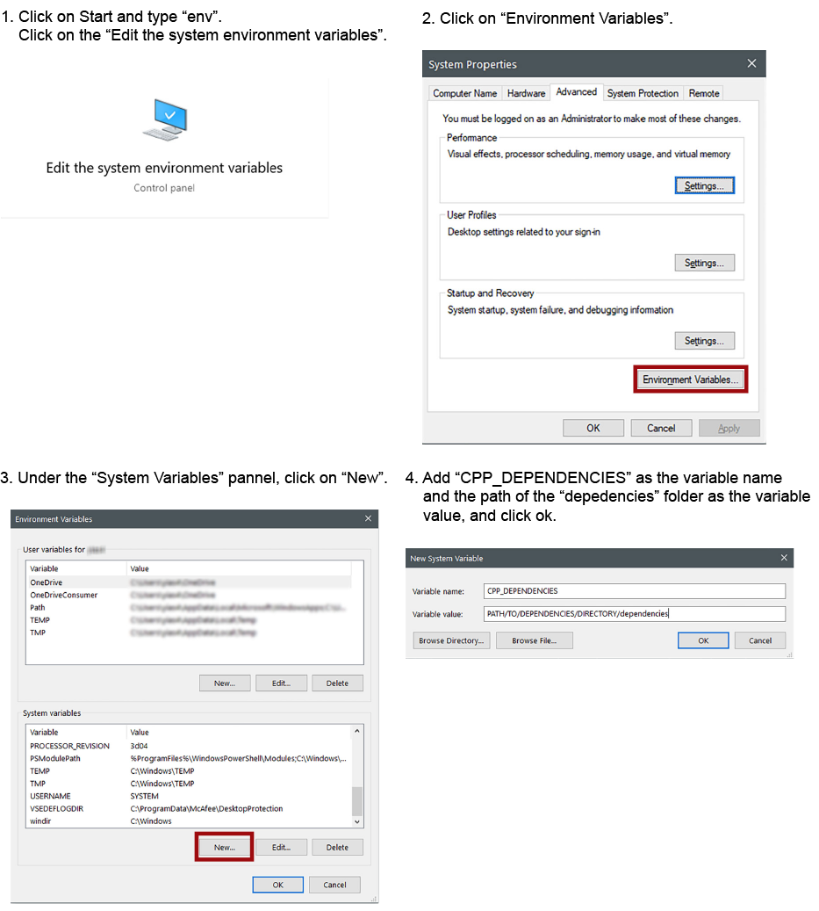
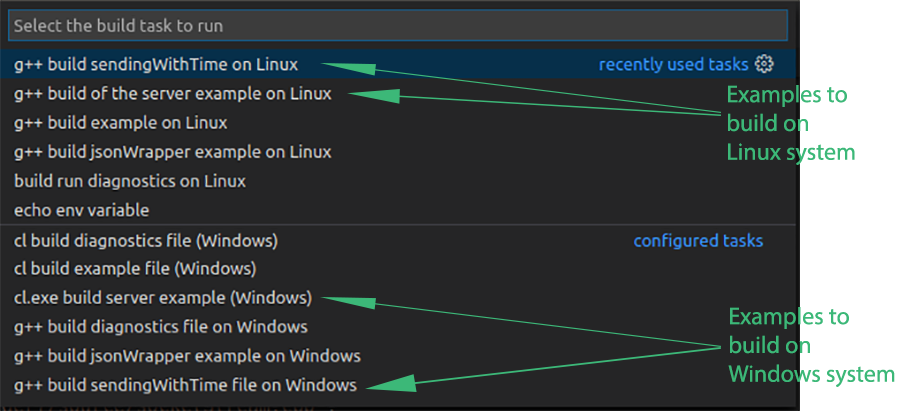

A cros-platform C++ library and Python module for exchanging packets over a TCP/IP communication. The socketSteam class supports both client and server implementations on C++ and python. The packets follow the json structure, making them compatible with other languages too. The C++ library supports multi-client server, whilst the server of the python class services only one client. 

The C++ implementaion of md5 checksum is a RSA Data Security, Inc. MD5 Message-Digest Algorithm, borrowed from zedwood in this [link](http://www.zedwood.com/article/cpp-md5-function). Desides the md5 implementation, the rest of the code is distributed under the GNU GPLv3 license.

The package requires at least C++11 or Python version greater or equal to 2.7.

## Set-up
1) Open a terminal or command prompt (on Windows) and navigate to your workspace. In your workspace folder, create a folder called "dependencies" to contain the cpp dependencies (if it doesn't already exist)

```bash
$ mkdir dependencies
```

2) go inside the folder dependencies and clone the rapidjson library from their [github repo](https://github.com/Tencent/rapidjson/)

```bash
$ cd dependencies
$ git clone https://github.com/Tencent/rapidjson.git
```

3) create an environment variable to contain the path of the dependencies directory

-- On Linux

Open the .bashrc file in your hone directory

```bash
$ cd
$ sudo gedit .bashrc
```

add the following line at the end of the file

export CPP_DEPENDENCIES="PATH/TO/DEPENDENCIES/DIRECTORY/dependencies"

*the "PATH/TO/DEPENDENCIES/DIRECTORY" corresponds to the path where of the folder "dependencies" that is created on the 1st step. If you don't know the path, navigate to the folder "dependencies" in a terminal (or command prompt on Windows) and type "pwd", it will print the path of this directory 

close the .bashrc file and relaunch the terminal. If you want to be sure that the variable is set properly, type the following command in the terminal (or command prompt on Windows)

```bash
$ echo $CPP_DEPENDENCIES
```

and it should print the path on the folder "dependencies"

-- On Windows



4) clone the socketStream package in workspace directory

```bash
$ git clone https://github.com/yias/socket_jsonCpp.git
```

## Building and running the examples
As the prokect has been developed on VSCode, the file "tasks.json" inside the folder ".vscode" contains the compiler's commands to build the examples in the "source" folder. If you have VSCode installed on your system, open a terminal on Linux or a command promt on Windows (preferably a [PowerShell](https://github.com/PowerShell/PowerShell)), navigate to the project's folder and rum the command:

```bash
$ code .
```

to launch VSCode. The IDE recognizes automatically the "tasks.json" file and you can build the examples by clicking CTLR+SHIFT+B and select the programm you would like to build by selecting the task on the menu. Each task indicates the OS that can generate the executables (see the picture below). As a test, you can build the server example (serverExample) and the client sendWithTime on the operating system.



-- For Linux, there is an option to build the examples by using the Makefile. For doing so, open a terminal, navigate inside the project's folder, and run the command:

```bash
$ make
```

(for building all the examples inside the "source", run the command make all)

Either by building from VSCode or the Makefile, two executables will be generated inside the folder "build". The "serverExample" runs a socketStream server that waits for clients to connect and receives their packets. The "sendWithTime" runs a socksetStream client which sends packets to the server for a specific duration with a frequency of approximatelly 100Hz.


-- For running the server example, open a terminal, navigate inside the project's folder, and type the command:

- on Linux:

```bash
$ ./build/serverExample.exe
```

- on Windows:

```bash
$ .\build\serverExample.exe
```

-- For running the sendWithTime example, open another terminal, navigate inside the project's folder, and type the command:

- on Linux:

```bash
$ ./build/sendWithTime.exe 
```

- on Windows:

```bash
$ .\build\sendWithTime.exe 
```

Once both the programs are running, the terminal on the server side should print something similar to the following picture. The server receives the packets from the sendWithTime program and prints the frequency that it receives the packets.


Information on the socketStream and jsonWrapper classes and their methods are included in the folder docs. [TO DO]

## Running the ros node
-- For runnng the C++ rosnode:

```bash
$ rosrun socketstream_node socketStream
```

-- for runnng the Python rosnode:

To launch the python node with rosrun, first, make executable the socketStream_rosnode.py by navigating in the folder "scripts" and type the command:

```bash
$ chmod +x socketStream_rosnode.py
```

Then, run command:

```bash
$ rosrun socketstream_node socketStream_rosnode.py
```

